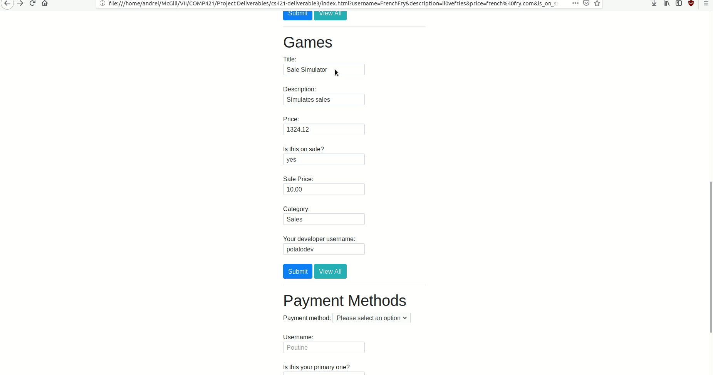

# RISEUP GAMERS

Welcome to the RiseUp Gamers repository. This contains the code for the app deliverable in COMP421 for Group 32.

Navigating this repository:

* `index.html` contains a bare-bones front-end for the application, to be able to interact with it;
* `app.py` contains a Flask back-end application which uses `utils.py` to connect to our Database via an SSH Tunnel to the `cs.mcgill.ca` server. For more information on how to get set up, visit the README in the directory `docs`;
* `gifs` contains various gifs showcasing our app in action;
* There are various `csv` files used for graphs included in our report.

## Context

The application is a cryptocurrency-enabled point of sale for videogames. Our app showcases some basic functionalities of this application, as defined by our database structure described in previous deliverables. It connects to the instance on the `cs.mcgill.ca` server via an SSH Tunnel, and has a frontend built using minimal HTML simply as a proof-of-concept.

This minimum viable product shows most, but not all, of the abilities of our database:

## Accounts
Each time an account is created, regardless of type, we also write a SQL Query to get interesting data back to the user.
* Creating user accounts and viewing existing user accounts (note: this Gif includes a few error scenarios before the success scenario. Sit tight!);

* Creating developer accounts and viewing their contents;

* As you may notice, the app shows the DB constraints on password length

## Games
Games are central to our application as it is what users purchase. The form for creating games comes pre-filled with some data to guide the user for the fields which are not mandatory; the users can delete the default data and run few risks of getting errors despite keeping those fields empty. The fields which are mandatory simply have placeholders. The requirement on the front-end forces users to write data in those fields, as submitting the form without them guarantees an error message otherwise.

Whenever a game is created, the developer is shown other games in the same category with which their game competes with.
* Creating games

* Creating games on sale, without a price, is not allowed

* Creating games on sale, with a price, is allowed

* Creating games with non-existent developers is not allowed

## Payment Methods
The final component of our minimum viable product: Payment methods used to purchase games. There are three payment methods available. Creating a paymen method of any type shows the user their other payment methods of the same type.

* Creating credit cards which are expired warns the user about their card's invalidity.

* Creating cards which are not expired will be added to the user's arsenal

* We can also add credit cards to users which already have a few other credit cards (or payment methods)

* We can also create RiseUp Wallets and Paypal accounts as payment methods

